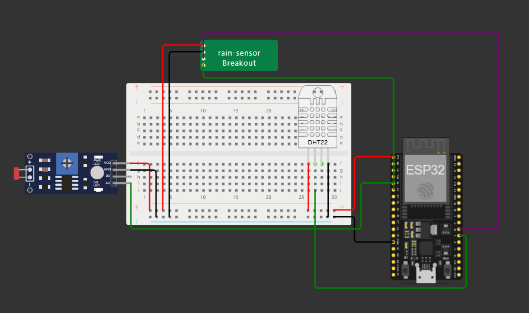
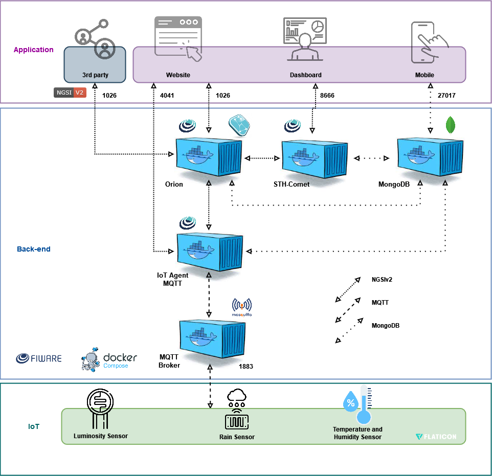

# Sensor Meteorológico para Formula E

## Descrição do Projeto

Este projeto consiste em um sensor meteorológico projetado para captar informações sobre as condições climáticas das pistas de corrida da Formula E. O sensor coleta dados sobre luminosidade, temperatura, umidade e precipitação, possibilitando a avaliação das condições atmosféricas em tempo real. Essas informações são essenciais para a equipe TechSphere, pois permitem que os dados climáticos sejam informados diretamente no site da equipe, auxiliando em decisões estratégicas durante as corridas.

## Objetivo

O principal objetivo deste projeto é fornecer dados climáticos precisos e em tempo real que podem ser utilizados pela equipe TechSphere para:

- Monitorar as condições climáticas nas pistas de corrida.
- Informar as decisões durante as corridas com base em dados meteorológicos.
- Melhorar a comunicação das condições do tempo para os fãs e participantes da corrida.

Além disso, o projeto visa implementar as configurações do FIWARE, seguindo as instruções do [FIWARE Descomplicado](https://github.com/fabiocabrini/fiware) do professor [Cabrini](https://www.linkedin.com/in/fabio-cabrini/), para garantir que os dados coletados sejam gerenciados de forma eficiente e estejam disponíveis para utilização em aplicações IoT.

## Arquitetura da Solução IoT

## Recursos Necessários

### Dispositivos IoT

- Sensor de luminosidade (LDR)
- Sensor de temperatura e umidade (DHT22)
- Sensor de chuva
- Módulo ESP32 para conectividade Wi-Fi

### Back-end

- Broker MQTT para gerenciamento de mensagens
- Servidor para processamento de dados (pode ser configurado com FIWARE)

### Front-end

- Site da equipe TechSphere para apresentação dos dados climáticos
- Interface de usuário para visualização em tempo real das condições meteorológicas

## Instruções de Uso

1. Conecte todos os sensores ao módulo ESP32 conforme o esquema elétrico fornecido.
2. Carregue o código-fonte no ESP32 utilizando a IDE Arduino ou outro ambiente de desenvolvimento compatível.
3. Configure as credenciais do Wi-Fi e do Broker MQTT no código.
4. Inicie o módulo e monitore os dados através do site da equipe TechSphere.

## Requisitos

- Módulo ESP32
- Bibliotecas: DHT, PubSubClient, WiFi
- Ambiente de desenvolvimento compatível (IDE Arduino, PlatformIO, etc.)

## Dependências

- A biblioteca DHT para leitura de temperatura e umidade.
- A biblioteca PubSubClient para gerenciamento de mensagens MQTT.

## Código Fonte

O código-fonte completo do projeto pode ser encontrado no diretório `src/`. Certifique-se de ter todas as dependências instaladas para garantir o funcionamento correto da aplicação.

